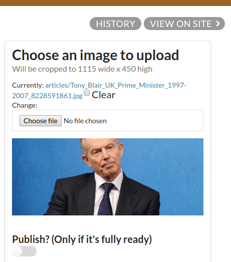
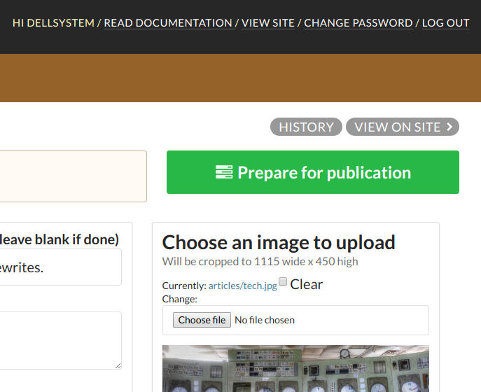
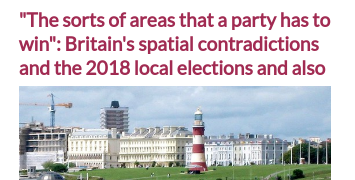
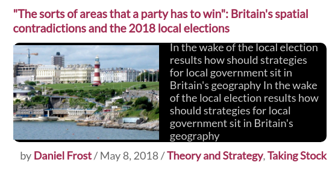
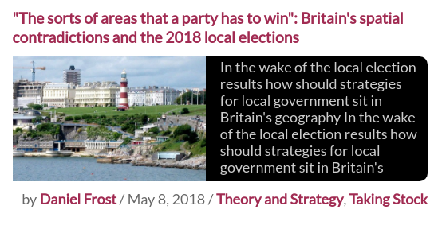
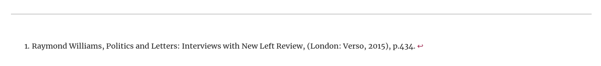
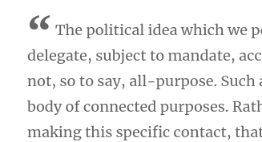
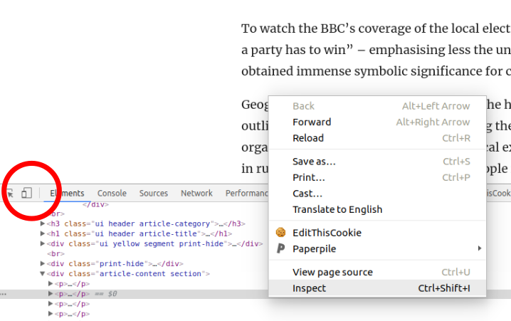
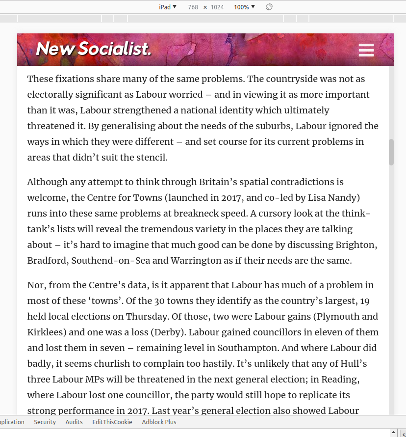

# Article checklist

* [Title](#title)
* [Subtitle](#subtitle)
* [Image](#image)
* [Author](#author)
* [Tags](#tags)
* [Date](#date)
* [Formatting](#formatting)
* [Posting to Twitter](#posting-to-twitter)

A list of things for editors (and particular the online editor) to check before making the article live.

To preview an article before it's published, make sure the "Publish?" field (under the image) is untoggled (i.e., grey not blue), and click the "View on site" button (top right) on the article edit page after the article has been created:



You should then verify the following attributes of the article before setting it live (i.e., toggling "Publish?") . Note that the "Preview" box will only show up if you're logged in as an editor (go to /editor/ to log in).



## Title

The constraining factor is the design on the left, where it should never exceed 3 lines; otherwise the remaining bits will get cut off, like this:



This particular title, `"The sorts of areas that a party has to win": Britain's spatial contradictions and the 2018 local elections`, at 107 characters, is straining the limits of what's possible with the design. Aim for below 100 characters if possible. Ideally, below 50, even.

It can be sentence case or title case, but there should not be a full stop at the end.

## Subtitle

Maximum of 215 characters. Ideally, 120-180. Constrained by the display on the right, where it should never exceed 7 lines. Here's how it looks when it gets to 8 lines:



7 lines isn't great either (not enough negative space around the edges) but is acceptable if absolutely necessary:



This particular subtitle, `In the wake of the local election results how should strategies for local government sit in Britain's geography` is fine in terms of length, but should really be made into a proper sentence, with full punctuation:

> In the wake of the local election results, how should strategies for local government sit in Britain's geography?

## Image

This photo is decent because it looks fine in all cropped variants. Note that all the cropping happens automatically, on the server side: the large photo will get cropped to 1115x450, while the thumbnails in the preview box are 540x350 (taking the centre of the photo as the locus point). Try to choose photos that will look good when cropped.

If the article doesn't need to go out right away, and you can't think of an optimal image, consider getting a custom illustration (just ask in Slack!).

Make sure we have usage rights for the photo! Creative commons or public domain photos are best. If attribution is necessary, add it to the "Image credit" field, which accepts Markdown formatting. For example,

`Photo: [John Smith](http://johnsmith.com)`

will show up as

> Photo: [John Smith](http://johnsmith.com)

## Author

Make sure the author's name and Twitter handle are correct. If the author has provided a bio, it will show up at the bottom of the page (Markdown formatting accepted).

## Tags

Make sure the appropriate sections are added as tags. This particular article has two tags: `Theory and Strategy` and `Taking Stock`.

## Date

Make sure the date is correct.

## Formatting

In general, we use markdown for formatting. A guide is available here: [Markdown Cheatsheet](https://github.com/adam-p/markdown-here/wiki/Markdown-Cheatsheet)

Make sure the following things are correctly formatted according to Markdown standards:

### URLs

`[this is a link](http://example.com)`

### Bold

`**word**` (should not be used for emphasis, though - use italics instead. fine for specialised formatting)

### Italics

`_word_`

### Footnotes

this one is a little trickier. In the body itself, use `word[^1]`. Then, at the end of the document, define the footnote like `[^1]: text`.

It should look like this in the article preview (if it doesn't, then you've done something wrong):



### Blockquotes

Use Markdown's blockquote formatting:

```
> quote starts here
```

Should look like this:



### Headings

Use Markdown's standard heading formatting. For top-level headers, use `## Heading`. Add one `#` for each level below:

```
## Heading

words

### Subheading

words

#### Further subheading

words
```

### Uploading images

From the main admin page, click on "Images" and then the "ADD IMAGE UPLOAD" button (top right corner). Set the title to something descriptive—the slug field will automatically be populated from there. You can think of the slug as the (unique) name which you'll use to refer to this file in order to embed it within an article.

For example, if you upload an image with the slug `test-image-1`, you can embed it within an article using the following code:

```
[img:test-image-1]
```

If you want to add a caption below it:

```
[img:test-image-1 This is a caption]
```

## Posting to Twitter

### Screenshots

Usually, when posting new articles out on Twitter, we post 1 or 2 screenshots of the article as separate tweets. Taking good screenshots is an art in itself, and worth doing properly. Two main considerations: 1) avoid excess whitespace (especially around the sides); 2) and ensure the text is large enough.

Some examples of good screenshots:


Some examples of less good screenshots:

 (too much whitespace around the sides; paragraphs too wide; snippet of the site header)

 (again paragraphs too wide; whitespace different on each side)

To take good screenshots, I recommend using Chrome's device simulation feature (Ctl+Shift+I, or right click -> Inspect, then click the device icon in the top left corner of the inspector pane):



Set the device to iPad, and the width to 100%, then drag the top of the inspector toolbar to the bottom of the page if necessary. The end result should look something like this:



Then just take a screenshot within the iPad preview window (omitting the menu bar and the scrollbar). I don't know what the process is like on Windows or Mac (I use Linux) but I'm sure there exists a tool to take a screenshot of a custom box. Try to keep it reasonably short. Headers and blockquotes are fine.

### Tweet text

Use the @NewSocialistUK Twitter account, or ask someone to tweet it (in Slack or the group DM) if you don't have access to the account. Feel free to tweet it out from your personal account as well (or you can just retweet @NewSocialistUK when it comes out - up to you).

Make sure to mention the author's Twitter username (if available) and link the article at the very end of the tweet. Should be sentence case, but it doesn't have to be a full sentence. Some perfectly reasonable examples:

* [Here's @malaiseforever on how socialist political education could help build collective self-confidence and sharpen popular demands:](https://twitter.com/NewSocialistUK/status/1008312214498021377)
* [The story of Chilean President Salvador Allende's efforts to secure Chile's road to socialism through cutting-edge central planning by @jackyatess](https://twitter.com/NewSocialistUK/status/1006886020946780160)

**You can preview what the tweet will look like before you post it!** Use this tool: [Twitter card validator](https://cards-dev.twitter.com/validator)
